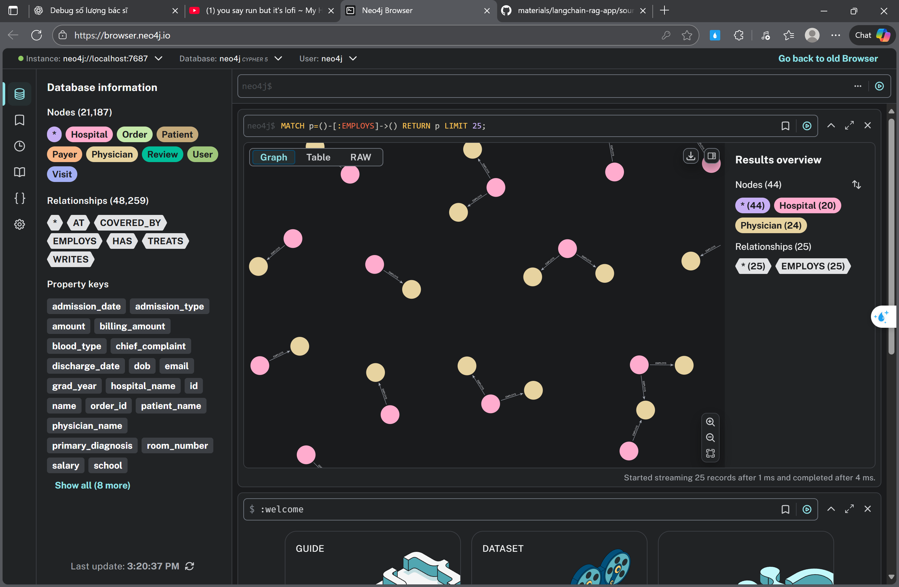

# LLM-CHATBOT-MEDICAL-WITH-MLOPS-PIPELINE
An enterprise healthcare intelligence system with comprehensive MLOps infrastructure, leveraging Neo4j graph database for hospital operations, Elasticsearch for DSM5 clinical knowledge retrieval, LangChain agents for multi-tool reasoning, and FastAPI for production inference serving with Redis caching and Streamlit frontend.
## ARCHITECTURE 


## TABLE OF CONTENTS
- [1. Understanding Business Data](#1-understanding-business-data)
  - [1.1 Data Overview](#11-data-overview)
  - [1.2 Data Schema Description](#12-data-schema-description)
    - [1.2.1 Physicians](#121-physicians)
    - [1.2.2 Hospitals](#122-hospitals)
    - [1.2.3 Payers](#123-payers)
    - [1.2.4 Patients](#124-patients)
    - [1.2.5 Reviews](#125-reviews)
    - [1.2.6 Visits](#126-visits)
  - [1.3 Data Relationships and Star Schema](#13-data-relationships-and-star-schema)
- [2. Design the Hospital System Graph Database](#2-design-the-hospital-system-graph-database)
  - [2.1 Graph Database Design](#21-graph-database-design)
  - [2.2 Setup Neo4j Instance](#22-setup-neo4j-instance)
  - [2.3 ETL Data CSV to Neo4j](#23-etl-data-csv-to-neo4j)
- [3. Design Agent and Tools](#3-design-agent-and-tools)

## 1. Understanding Business Data

### 1.1 Data Overview

This project utilizes a comprehensive healthcare dataset that models a hospital management system. The dataset consists of six interconnected CSV files that represent various entities within a healthcare ecosystem, following a star schema design pattern.

The dataset provides a realistic representation of hospital operations, including:
- **Medical Staff Management**: Information about physicians and their qualifications
- **Facility Management**: Details about hospitals and their locations
- **Patient Care**: Patient demographics and medical records
- **Financial Operations**: Insurance payers and billing information
- **Service Quality**: Patient reviews and feedback
- **Clinical Operations**: Visit records and treatment details

### 1.2 Data Schema Description

#### 1.2.1 Physicians
The `physicians.csv` file contains comprehensive information about medical staff working within the hospital system.

**Schema:**
- `physician_id` (Integer): Unique identifier for each physician
- `physician_name` (String): Full name of the physician
- `physician_dob` (Date): Date of birth of the physician
- `physician_grad_year` (Integer): Year the physician graduated from medical school
- `medical_school` (String): Name of the medical school attended
- `salary` (Float): Annual salary of the physician

**Purpose:** This table serves as the master record for all medical practitioners and is referenced by the visits table to track which physician treated each patient.

#### 1.2.2 Hospitals
The `hospitals.csv` file records information about each hospital facility managed by the healthcare system.

**Schema:**
- `hospital_id` (Integer): Unique identifier for each hospital
- `hospital_name` (String): Official name of the hospital
- `hospital_state` (String): State where the hospital is located

**Purpose:** This table maintains facility information and is used to track where patients receive treatment, enabling geographic analysis of healthcare services.

#### 1.2.3 Payers
The `payers.csv` file contains information about insurance companies that cover patient treatments.

**Schema:**
- `payer_id` (Integer): Unique identifier for each insurance provider
- `payer_name` (String): Name of the insurance company

**Available Payers:** The dataset includes five major insurance providers:
- Medicaid
- UnitedHealthcare
- Aetna
- Cigna
- Blue Cross

**Purpose:** This table tracks insurance coverage and is essential for billing and financial analysis of healthcare services.

#### 1.2.4 Patients
The `patients.csv` file stores demographic and basic medical information about patients.

**Schema:**
- `patient_id` (Integer): Unique identifier for each patient
- `patient_name` (String): Full name of the patient
- `patient_sex` (String): Gender of the patient (Male/Female)
- `patient_dob` (Date): Date of birth of the patient
- `patient_blood_type` (String): Blood type of the patient

**Purpose:** This table maintains patient demographics and medical characteristics, serving as the foundation for patient care tracking and medical history management.

#### 1.2.5 Reviews
The `reviews.csv` file captures patient feedback and experiences during their hospital stays.

**Schema:**
- `review_id` (Integer): Unique identifier for each review
- `visit_id` (Integer): Links the review to a specific hospital visit
- `review` (Text): Free-form patient feedback and comments
- `physician_name` (String): Name of the attending physician
- `hospital_name` (String): Name of the hospital where treatment occurred
- `patient_name` (String): Name of the patient providing the review

**Purpose:** This table enables quality assessment, patient satisfaction analysis, and helps identify areas for improvement in healthcare delivery.

#### 1.2.6 Visits
The `visits.csv` file serves as the central fact table, recording detailed information about each hospital admission and treatment episode.

**Schema:**
- `visit_id` (Integer): Unique identifier for each hospital visit
- `patient_id` (Integer): Links to the patient receiving treatment
- `date_of_admission` (Date): When the patient was admitted
- `room_number` (String): Hospital room assigned to the patient
- `admission_type` (String): Type of admission (Elective, Emergency, Urgent)
- `chief_complaint` (String): Primary reason for the hospital visit
- `primary_diagnosis` (String): Main medical diagnosis given by the physician
- `treatment_description` (Text): Summary of medical treatments provided
- `test_results` (String): Results of medical tests (Inconclusive, Normal, Abnormal)
- `discharge_date` (Date): When the patient was discharged
- `physician_id` (Integer): Links to the attending physician
- `hospital_id` (Integer): Links to the hospital where treatment occurred
- `payer_id` (Integer): Links to the insurance provider
- `billing_amount` (Float): Total amount billed for the visit
- `visit_status` (String): Current status of the visit (OPEN, DISCHARGED)

**Purpose:** This is the primary transactional table that connects all other entities and enables comprehensive analysis of healthcare operations, costs, and outcomes.

### 1.3 Data Relationships and Star Schema

The dataset follows a **star schema** design pattern with `visits.csv` as the central fact table, connected to multiple dimension tables:

```
                    Physicians
                        |
                        |
Hospitals ---- Visits (Fact Table) ---- Patients
                        |
                        |
                    Payers
                        |
                        |
                    Reviews
```

## 2. Design the Hospital System Graph Database

### 2.1 Graph Database Design

After analyzing the business data described above, a graph database has been designed as shown below:


#### Core Nodes (Main Entities):

**1. Patient (Patient Node):**
- Represents individuals seeking medical care
- Can have multiple Visit relationships (multiple hospital visits)

**2. Visit (Visit Node):**
- Central hub of the system
- Each Visit connects to:
  - **Hospital**: Location where treatment occurs
  - **Physician**: Doctor providing treatment
  - **Payer**: Insurance covering the visit
  - **Patient**: Individual receiving care

**3. Hospital (Hospital Node):**
- Healthcare facility that EMPLOYS physicians
- Location where visits take place (AT relationship)

**4. Physician (Physician Node):**
- Medical professionals EMPLOYED by hospitals
- TREATS patients through Visit relationships

**5. Payer (Insurance/Payment Entity):**
- Insurance companies or payment organizations
- Connected via COVERED_BY relationship indicating visit coverage

**6. Review (Review Node):**
- Patient feedback and ratings
- WRITTEN by patients after visits or treatments

#### Relationship Flow Logic:

1. **Hospital → EMPLOYS → Physician**: Hospitals hire and employ medical staff
2. **Physician → TREATS → Visit**: Doctors provide medical treatment during visits
3. **Visit → AT → Hospital**: Medical visits occur at specific hospital locations
4. **Visit → COVERED_BY → Payer**: Visits are covered by insurance or payment entities
5. **Patient → HAS → Visit**: Patients can have multiple hospital visits
6. **Patient → WRITES → Review**: Patients provide feedback after medical visits

#### Node Properties:

Each node contains properties similar to the corresponding CSV table attributes. Additionally, the Review node includes an **embedding** property that contains the vector embedding of the review text for semantic search capabilities:


#### Relationship Properties:

Each relationship has an **id** property. The COVERED_BY relationship between Visit and Payer nodes includes two additional properties:
- **billing_amount**: Financial amount for the visit
- **service_date**: Date when the service was provided


### 2.2 Setup Neo4j Instance

**Step 1: Run Docker Compose**
```bash
docker compose -f neo4j.yml up -d
```

**Step 2: Access Neo4j Browser**
Navigate to `localhost:7474` in your web browser. You should see the following interface:


**Step 3: Enter Neo4j Workspace**
Click the "Let's go" button below "Try the new hosted Browser". You will see the main Neo4j interface:


### 2.3 ETL Data CSV To Neo4j

This section describes how structured CSV files are loaded into the Neo4j graph database, how to run the ETL script included in this repository, how to validate the import, and some troubleshooting tips.

#### 2.3.1 What the ETL does

The ETL implemented in `backend/etl_neo4j/script.py` performs the following tasks:

- Creates uniqueness constraints for each node label (Hospital, Payer, Physician, Patient, Visit, Review).
- Loads nodes from CSV files into the corresponding node labels, mapping CSV columns to node properties.
- Loads relationships between nodes (AT, WRITES, HAS, TREATS, COVERED_BY, EMPLOYS) using the visit and review CSVs as the relationship source.
- Sets relationship properties where available (for example, `covered_by.billing_amount` and `covered_by.service_date`).

The CSV file paths are configured through environment variables in the `.env.dev` file (example names shown in `backend/etl_neo4j/script.py`). The ETL uses Neo4j's `LOAD CSV` cypher command and is resilient with simple retry logic around connectivity.

#### 2.3.2 How to run the ETL

1. Ensure a Neo4j instance is running and accessible. The project includes a sample docker-compose setup (see `neo4j.yml` or your local docker compose file).
2. Create a `.env.dev` file (or update it) at the repository root containing the following environment variables:
```
NEO4J_URI=bolt://localhost:7687
NEO4J_USER=neo4j
NEO4J_PASSWORD=yourpassword
GRAPHDB_NAME=neo4j
HOSPITALS_CSV_PATH=file:///path/to/hospitals.csv
PAYERS_CSV_PATH=file:///path/to/payers.csv
PHYSICIANS_CSV_PATH=file:///path/to/physicians.csv
PATIENTS_CSV_PATH=file:///path/to/patients.csv
VISITS_CSV_PATH=file:///path/to/visits.csv
REVIEWS_CSV_PATH=file:///path/to/reviews.csv
```
Notes:
- The `LOAD CSV` Cypher used by the script expects the CSV files to be accessible from the Neo4j server process. When running Neo4j in Docker, use `file:///` paths that refer to files inside the Neo4j container import directory (by default `/var/lib/neo4j/import`) or mount your local data directory to that path.

3. From the repository root run the ETL script:
```bash
python3 backend/etl_neo4j/script.py
```
The script performs a lightweight connectivity check first and then proceeds to create constraints, load nodes and relationships. Logging is emitted to the console. If you prefer, you can run the script inside the same container/network as Neo4j so the `file:///` paths resolve correctly.

#### 2.3.3 Expected result and quick verification

- After a successful import you should be able to open the Neo4j Browser (http://localhost:7474 by default)

- Run Cypher queries to inspect nodes and relationships. Example queries:
```
MATCH (h:Hospital) RETURN count(h);
MATCH (p:Physician) RETURN p.name LIMIT 10;
MATCH (v:Visit)-[:AT]->(h:Hospital) RETURN v.id, h.name LIMIT 10;
```
The repository includes a simple automated test `tests/neo4j_test.py` that compares a basic count computed from the original `data/english/visits.csv` against the number of physicians employed by a hospital in Neo4j. To run that test locally (requires the test environment variables set in `.env.dev`):
```bash
python3 tests/neo4j_test.py
```
What the test checks:
- It computes the number of distinct `physician_id` values in `data/english/visits.csv` for `hospital_id == 14`.
- It runs a Cypher query to count distinct `Physician` nodes that the `Hospital` node with `id=14` `EMPLOYS`.
- The test asserts the two counts are equal and prints the result.


## 3. Design Agent and Tools

### 3.1 Agent Architecture Overview

The Hospital RAG Agent is built using LangChain's agent framework to provide intelligent, multi-step responses to hospital-related queries. The agent combines multiple specialized tools that access different data sources to provide comprehensive answers.

**Key Components:**
- **Agent Executor**: Orchestrates the execution flow and manages tool calling
- **LLM (Language Model)**: Decides which tools to use and generates responses
- **Memory System**: Maintains conversation history using Redis
- **Multiple Tools**: Each tool specializes in different types of queries

### 3.2 Tools Overview

#### 3.2.1 Cypher Tool
**Purpose:** Execute custom graph queries using Cypher language

**Description:**
The Cypher Tool allows the agent to run arbitrary Cypher queries against the Neo4j graph database. This is useful for complex graph traversals and structured queries that require knowledge of the data schema.

**Use Cases:**
- Find all physicians employed by a specific hospital
- Get patient visit history
- Analyze hospital staffing levels
- Generate reports based on relationships between entities

**Example Query:**
```cypher
MATCH (h:Hospital {hospital_name: $hospital_name})-[:EMPLOYS]->(p:Physician)
RETURN p.physician_name, p.salary
ORDER BY p.salary DESC
```

#### 3.2.2 Review Tool
**Purpose:** Semantic search over patient reviews using vector embeddings

**Description:**
The Review Tool leverages Neo4j's vector index to perform semantic similarity search on patient reviews. It uses embedding models to find reviews semantically similar to user queries, enabling natural language search over unstructured review text.

**Key Features:**
- Vector embedding of review text
- K-nearest neighbors (KNN) search for similarity
- Returns relevant reviews with context about physicians, hospitals, and patients

**Use Cases:**
- "What do patients say about hospital quality?"
- "Find reviews mentioning long wait times"
- "Get feedback about specific physicians"
- "Analyze patient satisfaction trends"

**How It Works:**
1. User query is embedded using the same embedding model as the reviews
2. Neo4j performs vector similarity search
3. Top-K most similar reviews are returned with metadata
4. Results are formatted with context (hospital name, physician, patient name)

#### 3.2.3 Wait Times Tool
**Purpose:** Get current wait times at specific hospitals

**Description:**
Provides real-time or near-real-time wait time information for hospital visits. This tool interfaces with a wait time management system to provide up-to-date operational metrics.

**Function:** `get_current_wait_times(hospital_name: str) -> str`

**Example Usage:**
- "What is the current wait time at Jordan Inc Hospital?"
- "How long is the wait at City General?"

**Input Format:**
- Hospital name (without the word "hospital")
- Example: Input "Jordan Inc" for "Jordan Inc Hospital"

**Output Format:**
Returns wait time in minutes as a formatted string

#### 3.2.4 Availability Tool
**Purpose:** Find hospitals with shortest wait times

**Description:**
Identifies which hospital in the system currently has the shortest wait time, useful for patients trying to decide where to seek care.

**Function:** `get_most_available_hospital() -> dict`

**Example Usage:**
- "Which hospital has the shortest wait time?"
- "Where should I go for the quickest service?"

**Output Format:**
Returns a dictionary with hospital names as keys and wait times in minutes as values:
```python
{
    "Jordan Inc": 15,
    "City General": 23,
    "...": "..."
}
```

### 3.3 Agent Configuration

#### 3.3.1 Models Supported

**LLM Models:**
- `gpt-4o-mini`: OpenAI's efficient GPT-4 variant (recommended for cost)
- `gpt-4`: Full OpenAI GPT-4 model (higher performance)
- `models/gemini-2.5-flash-lite`: Google's Gemini Flash model (fast and efficient)
- `models/gemini-pro`: Google's full Gemini model (higher quality)

**Embedding Models:**
- `text-embedding-3-small`: OpenAI (1536 dimensions)
- `text-embedding-3-large`: OpenAI (3072 dimensions, higher quality)
- `models/gemini-embedding-001`: Google Gemini (768 dimensions)

#### 3.3.2 Agent Initialization

```python
from agents import HospitalRAGAgent

# Create agent instance
agent = HospitalRAGAgent(
    llm_model="google",              # or "openai"
    embedding_model="openai",        # or "google"
    user_id="user_123",
    session_id="session_456"         # optional
)

# Query the agent
query = "What hospitals have the shortest wait times?"
result = agent.invoke(query=query)
```

**Parameters:**
- `llm_model`: Choice of language model provider
- `embedding_model`: Choice of embedding model provider
- `user_id`: Unique user identifier for memory management
- `session_id`: Optional session identifier (auto-generated if not provided)

### 3.4 Agent Execution Modes

#### 3.4.1 Synchronous Execution (`invoke`)

Waits for complete response before returning.

```python
result = agent.invoke(query="What is the wait time at Jordan Inc?")

# Result structure:
{
    "output": "The current wait time at Jordan Inc is 15 minutes.",
    "intermediate_steps": [
        (AgentAction(...), "15 minutes"),
        ...
    ],
    "metadata": [...]
}
```

**Use Cases:**
- Simple queries that return quickly
- API endpoints with standard request-response pattern

#### 3.4.2 Asynchronous Execution (`ainvoke`)

Non-blocking async execution for integration with async frameworks.

```python
result = await agent.ainvoke(query="What is the wait time at Jordan Inc?")

# Same result structure as invoke()
```

**Use Cases:**
- FastAPI applications
- Concurrent query processing
- High-throughput systems

#### 3.4.3 Streaming Execution (`stream`)

Yields results progressively as tools execute, enabling real-time UI updates.

```python
for chunk in agent.stream(query="What is the wait time at Jordan Inc?"):
    if "actions" in chunk:
        # Tool is being called
        action = chunk["actions"][0]
        print(f"Calling tool: {action.tool}")
    elif "steps" in chunk:
        # Tool execution completed
        print("Tool result received")
    elif "output" in chunk:
        # Final response ready
        print(f"Final answer: {chunk['output']}")
```

**Chunk Types:**
- `actions`: Tool invocations being executed (LLM decided to use a tool)
- `steps`: Completed tool execution results
- `output`: Final agent response

**Use Cases:**
- Real-time chat interfaces
- Progressive response display
- Long-running queries with progress updates

#### 3.4.4 Async Streaming Execution (`astream`)

Combines async and streaming for real-time, non-blocking updates.

```python
async for chunk in agent.astream(query="What hospitals are available?"):
    if "actions" in chunk:
        for action in chunk["actions"]:
            print(f"🔧 Tool: {action.tool}")
            print(f"   Input: {action.tool_input}")
    elif "steps" in chunk:
        for step in chunk["steps"]:
            print(f"✅ Result: {step.observation}")
    elif "output" in chunk:
        print(f"📝 Answer: {chunk['output']}")
```

**Best For:**
- WebSocket-based real-time chat
- Progressive rendering in async web applications
- Complex queries that need to show thinking process

### 3.5 Memory Management

#### 3.5.1 Redis-Based Chat History

The agent uses Redis to maintain conversation history for multi-turn conversations.

**Configuration:**
```python
# In config.py
REDIS_URL: str = os.getenv("REDIS_URL")  # e.g., "redis://localhost:6379/0"
TTL: int = 86400  # 24 hours in seconds
MEMORY_TOP_K: int = 5  # Keep last 5 messages
```

**How It Works:**
1. Each user session gets a unique Redis key
2. Chat messages are stored with TTL (time-to-live)
3. Agent retrieves conversation context for each query
4. Maintains full conversation history for coherent multi-turn dialogues

#### 3.5.2 Memory Properties

```python
# Memory is automatically created per session
self.message_history = RedisChatMessageHistory(
    session_id=session_id,
    url=AppConfig.REDIS_URL,
    ttl=AppConfig.TTL
)

self._memory = ConversationBufferWindowMemory(
    chat_memory=self.message_history,
    memory_key="chat_history",
    return_messages=True,
    output_key="output",
    k=AppConfig.MEMORY_TOP_K  # Keep last 5 messages
)
```

### 3.6 Intermediate Steps and Reasoning

The agent exposes intermediate execution steps, allowing visibility into the agent's reasoning process.

**Metadata Extraction:**
```python
result = agent.invoke(query="What is the wait time?")

# Intermediate steps show tool calls and results
for action, observation in result["intermediate_steps"]:
    print(f"Tool: {action.tool}")
    print(f"Input: {action.tool_input}")
    print(f"Result: {observation}")
```

**Use Cases:**
- Debugging agent behavior
- Transparency for users (showing what tools were used)
- Tracing decision-making process
- Quality assurance and testing

### 3.7 Implementation Details

#### 3.7.1 Tool Selection Logic

The LLM decides which tools to use based on:
1. **Query understanding**: What is the user asking?
2. **Tool descriptions**: How does the tool help answer the question?
3. **Context**: What tools have been useful in similar contexts?

**Example Decision Flow:**
```
User Query: "What do patients say about hospital quality?"
    ↓
LLM Analysis: This is asking about patient feedback/reviews
    ↓
Tool Selection: ReviewTool (semantic search over reviews)
    ↓
Tool Execution: Search for reviews mentioning quality
    ↓
Response: "Patients mention..."
```

#### 3.7.2 Error Handling

The agent includes comprehensive error handling:

```python
try:
    result = agent.invoke(query=query)
except Exception as e:
    logger.error(f"Error in invoke: {e}")
    # Graceful error handling
    raise e
```

**Common Issues and Resolutions:**
- **Redis connection failure**: Check `REDIS_URL` and Redis server status
- **Neo4j connection failure**: Verify Neo4j instance is running
- **API key issues**: Ensure OpenAI/Google API keys are set in `.env.dev`
- **Embedding dimension mismatch**: Regenerate embeddings with matching model

### 3.8 Usage Examples

#### Example 1: Basic Query
```python
agent = HospitalRAGAgent(
    llm_model="google",
    embedding_model="openai",
    user_id="user_123"
)

response = agent.invoke("Which hospital has the shortest wait time?")
print(response["output"])
```

#### Example 2: Multi-turn Conversation
```python
agent = HospitalRAGAgent(
    llm_model="google",
    embedding_model="openai",
    user_id="user_123",
    session_id="conversation_1"
)

# First turn
response1 = agent.invoke("What hospitals are in New York?")

# Second turn - agent remembers previous context
response2 = agent.invoke("Which one has the best patient reviews?")
```

#### Example 3: Streaming with Real-time Display
```python
async for chunk in agent.astream("Get hospital information"):
    if "actions" in chunk:
        print("🔄 Thinking...")
    elif "steps" in chunk:
        print("✓ Retrieved data")
    elif "output" in chunk:
        print(f"Answer: {chunk['output']}")
```

### 3.9 Performance Tuning

**Optimization Tips:**
1. **Model Selection**: Use faster models for real-time applications (e.g., Gemini Flash)
2. **Memory Window**: Reduce `MEMORY_TOP_K` to limit context size for faster processing
3. **Vector Search**: Adjust `REVIEW_TOP_K` based on result quality vs. speed tradeoff
4. **Caching**: Implement caching for frequently asked questions
5. **Batch Processing**: Use async/streaming modes for concurrent queries