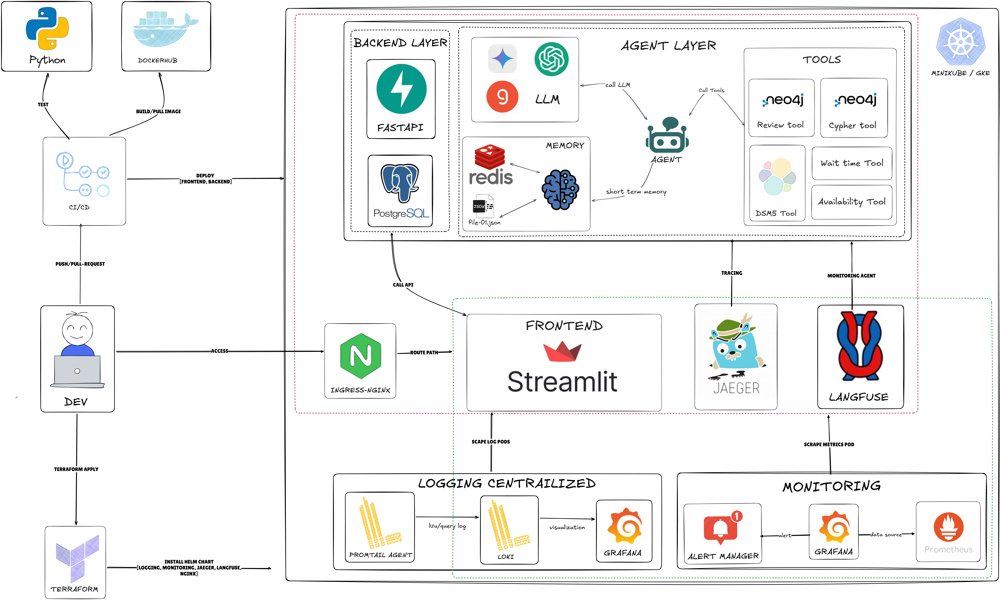

# LLM Chatbot with LangChain and Neo4j

An enterprise healthcare intelligence system combining knowledge graphs, semantic search, and intelligent agents to provide comprehensive hospital operations and psychiatric diagnostic insights.

## 📋 Overview

This project demonstrates a production-ready AI system that integrates:
- **Graph Database (Neo4j)**: Hospital operations, staff, and patient relationships
- **Vector Search (Elasticsearch)**: DSM-5 psychiatric diagnostic criteria with semantic search
- **LangChain Agents**: Multi-tool reasoning for complex healthcare queries
- **FastAPI**: High-performance REST API with production monitoring
- **Redis**: Chat history management for multi-turn conversations
- **Streamlit**: Interactive web interface for end users
### System Architecture


### Key Capabilities

✨ **Multi-source Intelligence**
- Hospital operations queries via graph database
- Patient reviews semantic search
- Psychiatric diagnostic information retrieval
- Real-time wait time information

🤖 **Intelligent Agent**
- Automatic tool selection based on query intent
- Multi-step reasoning for complex questions
- Transparent intermediate steps visibility
- Memory-aware multi-turn conversations

📊 **Production Ready**
- Comprehensive monitoring and tracing
- Automated evaluation framework
- Full test coverage
- Docker containerization

## 🎬 Video Demo

[Watch the system in action](./images/video-demo.mp4)

## 🏗️ Project Structure

```
LLM-Chatbot-with-LangChain-and-Neo4j/
├── backend/              # FastAPI server with agents and tools
├── frontend/             # Streamlit web interface
├── mlops/               # Infrastructure, monitoring, MLFlow
├── data/                # Healthcare datasets and DSM-5 documents
├── images/              # Project diagrams and demo video
└── README.md            # This file
```

## 🚀 Quick Start

### Prerequisites

- Docker & Docker Compose
- Python 3.10+
- OpenAI or Google API keys

### Setup

1. **Clone and navigate to the repository**
   ```bash
   cd LLM-Chatbot-with-LangChain-and-Neo4j
   ```

2. **Configure environment variables**
   ```bash
   cp backend/.env.dev .env
   # Edit .env with your API keys and database credentials
   ```

3. **Start services with Docker Compose**
   ```bash
   docker-compose up -d
   ```

4. **Initialize data**
   ```bash
   # Load hospital data into Neo4j
   python backend/process_data/index_neo4j.py
   
   # Index DSM-5 documents in Elasticsearch
   python backend/process_data/index_elastic.py
   ```

5. **Run backend**
   ```bash
   cd backend
   uvicorn main:app --host 0.0.0.0 --port 8000 --reload
   ```

6. **Run frontend** (in a new terminal)
   ```bash
   cd frontend
   streamlit run app.py
   ```

Access the application:
- 🎨 Frontend: http://localhost:8501
- 📡 API Docs: http://localhost:8000/docs
- 🌐 Neo4j Browser: http://localhost:7474

## 📚 Documentation

- **[Backend README](./backend/README.md)** - Detailed technical documentation
  - Data schema and relationships
  - Graph database design
  - Agent architecture and tools
  - API endpoints
  - Testing and evaluation

- **[MLOps README](./mlops/README.md)** - Infrastructure and monitoring
  - Kubernetes deployment
  - ELK stack monitoring
  - Infrastructure as Code

## 🔧 Core Components

### Backend (`/backend`)

FastAPI application with:
- **Agents**: Multi-tool reasoning system (`agents/hospital_rag_agent.py`)
- **Tools**: Specialized query tools for different data sources
  - Cypher queries for Neo4j
  - Semantic search for reviews
  - DSM-5 diagnostic lookup
  - Real-time wait times
- **API**: RESTful endpoints for chat, search, and queries
- **Tests**: Comprehensive test suite with integration tests

### Frontend (`/frontend`)

Streamlit application providing:
- Multi-turn chat interface
- Query streaming with real-time updates
- Conversation history management
- Intermediate step visualization

### Data (`/data`)

- **Hospital Data**: CSV files with physician, patient, hospital, visit, and review information
- **DSM-5 Documents**: Vietnamese psychiatric diagnostic criteria (PDF)
- **Evaluation Datasets**: Test queries for RAG evaluation

## 🛠️ Technology Stack

| Component | Technology |
|-----------|-----------|
| **LLM Framework** | LangChain |
| **Language Models** | OpenAI GPT-4, Google Gemini |
| **Embeddings** | OpenAI, Google |
| **Graph DB** | Neo4j |
| **Vector DB** | Elasticsearch |
| **Cache** | Redis |
| **API** | FastAPI |
| **Frontend** | Streamlit |
| **Monitoring** | Phoenix, MLFlow |
| **Containers** | Docker, Kubernetes |

## 📊 Data Flow

```
User Query
    ↓
Streamlit Frontend
    ↓
FastAPI Server
    ↓
LangChain Agent
    ├→ Cypher Tool (Neo4j)
    ├→ Review Tool (Semantic Search)
    ├→ DSM-5 Tool (Elasticsearch)
    └→ Utility Tools (Wait Times)
    ↓
Response Generation
    ↓
Frontend Display
```

## 🎯 Key Features

### 1. Knowledge Graph Integration
- Hospital, physician, patient, and visit relationships
- Relationship properties (billing, service dates)
- Vector embeddings for semantic review search

### 2. Hybrid Search
- Keyword search on DSM-5 documents
- Semantic vector search for similar content
- Combined ranking for best results

### 3. Agent Reasoning
- Automatic tool selection
- Multi-step query decomposition
- Conversational memory via Redis
- Explainable intermediate steps

### 4. Production Monitoring
- Distributed tracing with Phoenix
- Real-time metrics collection
- Performance monitoring
- Error tracking and logging

## 🧪 Testing & Evaluation

Run the test suite:
```bash
cd backend
pytest tests/
```

Evaluate RAG performance:
```bash
python evaluator/rag_cypher.py
python evaluator/rag_dsm5.py
```

## 📈 Performance Metrics

The system includes evaluation frameworks for:
- **Retrieval Quality**: Precision and recall of knowledge base queries
- **Agent Reasoning**: Correctness of tool selection and multi-step reasoning
- **Response Quality**: BLEU scores and semantic similarity

## 🔐 Security & Configuration

- API authentication with JWT tokens
- Environment-based configuration
- Secure credential management
- CORS and rate limiting

## 📝 API Examples

### Chat with Agent
```bash
curl -X POST "http://localhost:8000/v1/chat" \
  -H "Content-Type: application/json" \
  -d {
    "user_id": "user_123",
    "query": "What are the diagnostic criteria for autism spectrum disorder?",
    "session_id": "session_456"
  }
```

### Search DSM-5
```bash
curl -X GET "http://localhost:8000/v1/search/dsm5?query=depression&top_k=5"
```

### Cypher Query
```bash
curl -X POST "http://localhost:8000/v1/cypher" \
  -H "Content-Type: application/json" \
  -d {
    "query": "MATCH (h:Hospital)-[:EMPLOYS]->(p:Physician) RETURN h.name, p.name LIMIT 10"
  }
```

## 🤝 Contributing

1. Create a feature branch
2. Make changes with tests
3. Ensure all tests pass
4. Submit pull request

## References
- [LangChain Documentation](https://langchain.com/docs/)
- [Neo4j Documentation](https://neo4j.com/docs/)
- [Elasticsearch Documentation](https://www.elastic.co/guide/en/elasticsearch/reference/current/index.html)
- [FastAPI Documentation](https://fastapi.tiangolo.com/)
- [Streamlit Documentation](https://docs.streamlit.io/)
- [Redis Documentation](https://redis.io/documentation)
- [OpenAI API](https://platform.openai.com/docs/)
- [Google Generative AI](https://developers.generativeai.google/)
- [Chatbot Neo4j](https://realpython.com/build-llm-rag-chatbot-with-langchain/)

## 📄 License

This project is provided as-is for educational and research purposes.

## 🙋 Support

For issues and questions:
1. Check the [Backend Documentation](./backend/README.md)
2. Review test cases in `/backend/tests/`
3. Check MLOps documentation for infrastructure issues

---

**Last Updated**: January 2026
