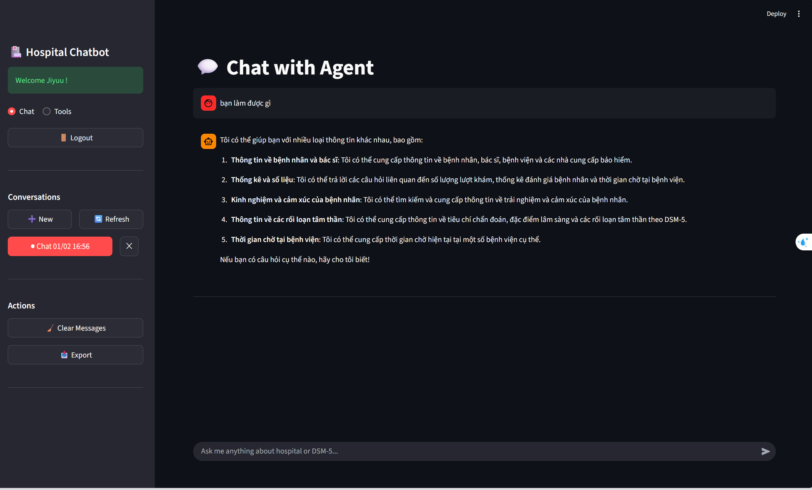
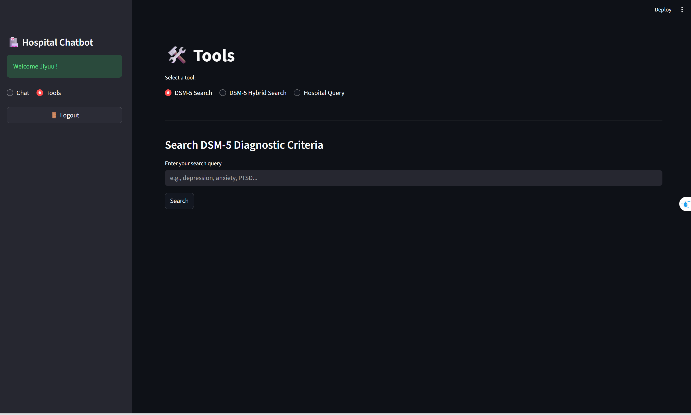

# Frontend README

A Streamlit-based web interface for the Hospital & DSM-5 Intelligent Chatbot system. Provides real-time chat interactions, tool access, and conversation management with a modern, responsive UI.

## TABLE OF CONTENTS

- [1. Overview](#1-overview)
- [2. Features](#2-features)
- [3. Project Structure](#3-project-structure)
- [4. Setup & Installation](#4-setup--installation)
- [5. Configuration](#5-configuration)
- [6. Usage Guide](#6-usage-guide)
- [7. Development](#7-development)

---

## 1. Overview

The frontend is a Streamlit application that provides users with an intuitive interface to interact with the LLM chatbot. It supports authentication, multi-turn conversations, tool access for specialized queries, and conversation management.

**Tech Stack:**
- **Framework:** Streamlit
- **API Client:** Python requests/httpx
- **State Management:** Streamlit session state
- **Styling:** Custom CSS and Streamlit theming

**Key Capabilities:**
- Real-time chat with streaming responses
- Multi-tool access (DSM-5 search, Hospital queries)
- Conversation history management
- User authentication and sessions
- Responsive dark-themed UI

---

## 2. Features

### 2.1 Authentication

```
┌─────────────────────┐
│   Login/Register    │
├─────────────────────┤
│ Username input      │
│ Password input      │
│ Submit button       │
│ Switch mode toggle  │
└─────────────────────┘
```

**Features:**
- User registration with validation
- Secure login with password hashing
- Session persistence
- Logout functionality
- User greeting

### 2.2 Chat Interface

**Main Chat Page:**
- Message input field with auto-focus
- Real-time streaming responses
- Conversation history display
- Conversation sidebar for navigation
- Message clear/export functionality

**Chat Display:**
- User messages (right-aligned, blue)
- AI responses (left-aligned, orange)
- Error messages (red with icon)
- Loading indicators for streaming

### 2.3 Conversation Management

**Sidebar Features:**
- List all conversations for logged-in user
- Create new conversation
- Switch between conversations
- Update conversation title
- Delete conversation
- Refresh conversation list

**Conversation History:**
- Persistent storage in database
- Timestamp tracking
- Message count display
- Auto-save on each message

### 2.4 Tools Page

Three specialized tools with independent interfaces:

**Tool 1: DSM-5 Search**
- Natural language query input
- Semantic search on DSM-5 database
- Structured results display
- Query and results count metrics

**Tool 2: DSM-5 Hybrid Search**
- Combined keyword + semantic search
- Customizable top-k results (1-20)
- Keyword weight adjustment
- Result count statistics

**Tool 3: Hospital Query**
- Neo4j Cypher query generation
- Hospital data retrieval
- Patient search functionality
- Hospital statistics queries

---

## 3. Project Structure

```
frontend/
├── app.py                    # Main entry point
├── requirements.txt          # Python dependencies
├── .env                      # Environment variables
├── .streamlit/
│   └── config.toml          # Streamlit configuration
├── Dockerfile               # Container image
├── pyproject.toml           # Project metadata
│
└── src/
    ├── __init__.py
    │
    ├── utils/
    │   ├── __init__.py
    │   ├── api_client.py     # Backend API client
    │   └── helpers.py        # Utility functions
    │
    ├── pages/
    │   ├── __init__.py
    │   ├── chat.py           # Chat page logic
    │   ├── tools.py          # Tools page logic
    │   └── styles.py         # CSS styling
    │
    └── components/
        ├── __init__.py
        ├── sidebar.py        # Sidebar component
        ├── messages.py       # Message display
        └── inputs.py         # Input fields
```

---

## 4. Setup & Installation

### 4.1 Prerequisites

- Python 3.10+
- Pip package manager
- Backend API running (see backend README)

### 4.2 Installation Steps

**Clone and navigate:**
```bash
cd frontend
```

**Create virtual environment:**
```bash
python -m venv venv
source venv/bin/activate  # On Windows: venv\Scripts\activate
```

**Install dependencies:**
```bash
pip install -r requirements.txt
```

**Dependencies:**
```
streamlit>=1.28.0
requests>=2.31.0
python-dotenv>=1.0.0
```

### 4.3 Quick Start

**Development Mode:**
```bash
streamlit run app.py
```

Access at: `http://localhost:8501`

**With Backend on Different Host:**
```bash
streamlit run app.py -- --backend-url http://your-backend:8000
```

---

## 5. Configuration

### 5.1 Environment Variables

**.env file:**
```bash
# Backend API
BACKEND_URL=http://localhost:8000
API_TIMEOUT=30

# Streamlit configuration
STREAMLIT_CLIENT_THEME_MODE=dark
STREAMLIT_CLIENT_TOOLBAR_MODE=minimal

# Session
SESSION_TIMEOUT=3600  # 1 hour
```

### 5.2 Streamlit Config

**.streamlit/config.toml:**
```toml
[theme]
primaryColor = "#1f77b4"
backgroundColor = "#0d1117"
secondaryBackgroundColor = "#1c2128"
textColor = "#c9d1d9"
font = "sans serif"

[client]
showErrorDetails = false
toolbarMode = "minimal"

[server]
port = 8501
headless = true
runOnSave = true
```

### 5.3 API Configuration

**api_client.py:**
```python
class APIClient:
    def __init__(self, base_url: str = None):
        self.base_url = base_url or os.getenv("BACKEND_URL", "http://localhost:8000")
        self.timeout = int(os.getenv("API_TIMEOUT", 30))
        self.session = requests.Session()
```

---

## 6. Usage Guide

### 6.1 Authentication Flow

**Register New User:**
```
1. Click "Create Account" on login page
2. Enter username and password
3. Click "Register"
4. Redirected to chat on success
```

**Login:**
```
1. Enter credentials
2. Click "Login"
3. Redirected to last conversation or new chat
```

### 6.2 Chat Interface

**Starting a Conversation:**
```
1. Click "New" in sidebar
2. Enter message in input field
3. Press Enter or click send button
4. Wait for streaming response
5. View response in chat area
```

**Managing Conversations:**
```
- View history: Listed in sidebar
- Switch conversation: Click on conversation item
- Update title: Click conversation settings
- Delete: Click delete icon
- Export: Click export button
```

### 6.3 Using Tools

**DSM-5 Search:**
```
1. Navigate to "Tools" tab
2. Select "DSM-5 Search"
3. Enter query (e.g., "autism diagnostic criteria")
4. Click "Search"
5. View results with metrics
```

**Hospital Query:**
```
1. Navigate to "Tools" tab
2. Select "Hospital Query"
3. Enter natural language query
4. System generates Cypher query
5. View results and generated query
```

---

## 7. Development

### 7.1 Project Layout

**Page Structure (app.py):**
```python
import streamlit as st
from src.pages import chat, tools

def main():
    # Authentication check
    if not st.session_state.get("authenticated"):
        show_auth_page()
    else:
        # Navigation
        page = st.sidebar.radio("Select", ["Chat", "Tools"])
        
        if page == "Chat":
            chat.show()
        elif page == "Tools":
            tools.show()

if __name__ == "__main__":
    main()
```

### 7.2 API Client Usage

**Making Requests:**
```python
from src.utils.api_client import APIClient

api_client = APIClient()

# Chat endpoint
result = api_client.chat(
    user_id="user_123",
    query="What is autism?"
)

# DSM-5 search
results = api_client.dsm5_search(
    query="autism spectrum disorder"
)
```

### 7.3 Session State Management

**Streamlit Session State:**
```python
# Initialize session
if "authenticated" not in st.session_state:
    st.session_state.authenticated = False
    st.session_state.user_id = None
    st.session_state.username = None

# Update session
st.session_state.authenticated = True
st.session_state.user_id = user_id
```

### 7.4 Custom Components

**Sidebar Component:**
```python
def show_sidebar():
    with st.sidebar:
        st.title("Hospital Chatbot")
        
        # User info
        st.write(f"Welcome {st.session_state.username}")
        
        # Conversations
        conversations = get_user_conversations()
        selected = st.selectbox("Conversations", conversations)
```
---

## 8. Demo 
- Chat with the chatbot about hospital data and DSM-5 criteria.


- Use Tools for specialized queries.
